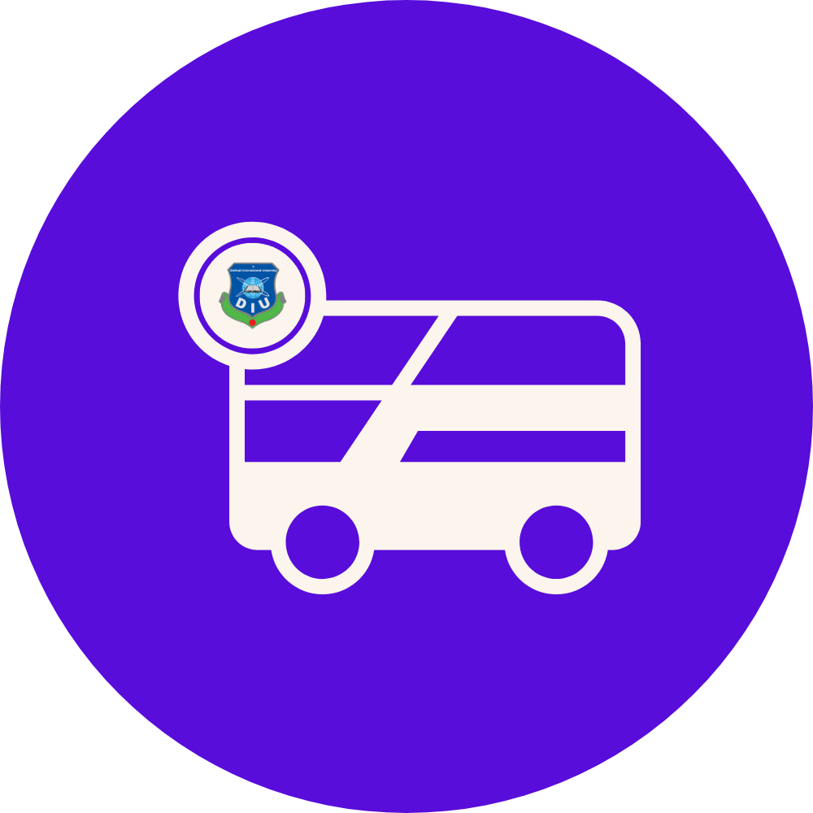

# DIU Route Explorer

[](https://flutter.dev/)
[](LICENSE)

<p align="center">
  
</p>

DIU Route Explorer is a comprehensive mobile application designed to streamline bus transportation for Daffodil International University students, faculty, and staff. The app provides real-time bus schedules, route information, and notifications to help users efficiently navigate university transportation.

## Features

- **Real-time Bus Schedules**: Access up-to-date bus schedules and departure times
- **Route Information**: View detailed information about bus routes and stops
- **User Authentication**: Secure login for students, faculty, and administrators
- **Administrative Dashboard**: Dedicated interface for transportation administrators
- **Push Notifications**: Receive important updates about schedule changes or delays
- **Dark/Light Theme Support**: Choose your preferred app appearance
- **Personalized Onboarding**: Customized experience for first-time users

## Screenshots


## Installation

1. **Prerequisites**:
   - Flutter SDK (version 3.7 or higher)
   - Dart SDK
   - Android Studio / VS Code with Flutter extensions

2. **Clone the repository**:
   ```bash
   git clone https://github.com/yourusername/diu-route-explorer.git
   cd diu-route-explorer
   ```

3. **Install dependencies**:
   ```bash
   flutter pub get
   ```

4. **Run the app**:
   ```bash
   flutter run
   ```

## Architecture

The application follows a provider-based state management approach and is organized into the following directory structure:

- `lib/screens/`: All app screens including login, bus schedules, and admin dashboard
- `lib/providers/`: State management using Provider pattern
- `lib/services/`: Backend services and API integration
- `lib/widgets/`: Reusable UI components

## Contributing

Contributions are welcome! Please feel free to submit a Pull Request.

1. Fork the repository
2. Create your feature branch (`git checkout -b feature/amazing-feature`)
3. Commit your changes (`git commit -m 'Add some amazing feature'`)
4. Push to the branch (`git push origin feature/amazing-feature`)
5. Open a Pull Request

## License

This project is licensed under the MIT License - see the LICENSE file for details.

## Acknowledgements

- Flutter Team for the amazing cross-platform framework
- Daffodil International University for supporting this project

---

*Made with ❤️ by MarsLab*
